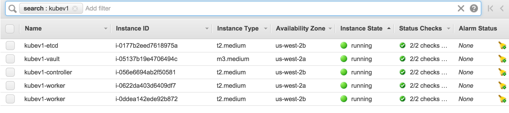
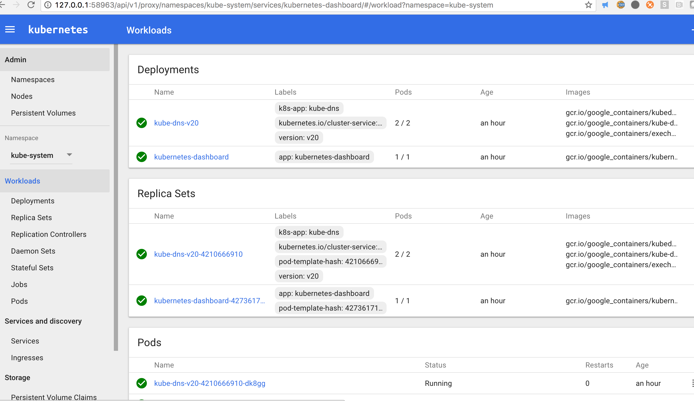
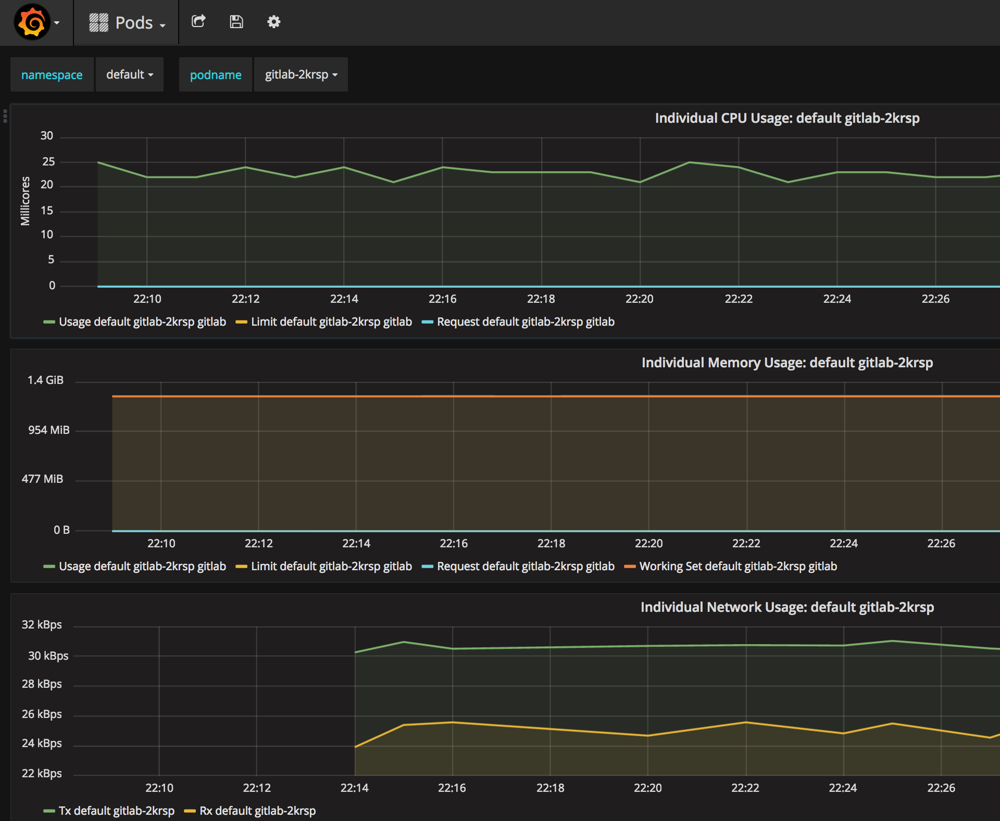

# Kubernetes on AWS with Terraform (KAT)

This is a Kubernetes implementation using [CoreOS](https://coreos.com/os/docs/latest/cluster-architectures.html#production-cluster-with-central-services) on AWS platform.

There are many quick ways to start a Kubernetes cluster, but the ongoing management and support does require deep understanding of the platform itself, unless the cluster is supported by a vendor product, such as GKE.

This implementation presents one of the opportunities for anyone who are interested in understanding some of the infrastructure-as-code technical stacks (Kubernetes, AWS, Terraform, CoreOS, Vault) and managing a cluster that can be upgraded safely. The design goal is to make both the cluster and the code highly flexible and customizable to adapt for fast changing technology and environments.

## Table of Contents ##
- [Features](#features)
- [Prerequisite](#prerequisite)
- [Quick Start](#quick-start)
- [Test Cluster](#test-cluster)
- [GitLab or GitHub webhook authentication](gitLab-or-GitHub-webhook-authentication)
- [Teardown](#teardown)
- [Cluster Guide](#cluster-guide)
- [Limitations](#limitations)
- [Major References](#major-references)
- [The Team](#the-team)

## Features

* Kubernetes v1.9.2, Docker engine 17.9.1, etcd v3, CNI v0.6.0.
* RBAC authorization mode enabled by default
* AWS provider integration (ELB,EBS)
* Terraform hashicorp/terraform:light (can be defined in `envs.sh`), which runs as a container to make sure the team uses the same version.
* Terraform remote state on S3 storage
* Autoscaling group for each etcd, master, node, and vault cluster for higher availability
* CoreOS for self-upgrade/patching management
* [Hashicorp Vault v0.11.3](https://www.vaultproject.io/) service with PKI mount to manage Kubernetes certificates, i.e. create and renew automatically.
* Using separated CA/Certs for secure communications between Kubernetes components
* Add-ons installed:
  * kubedns
  * kubernetes-dashboard
  * monitoring-grafana
 * Example app deployment
   * GitLab - demonstrate AWS load balancer integration
* Operation run book to cover common tasks

## Prerequisite

Basic knowledge about Kubernetes, AWS, Terraform, CoreOS, Vault and Make.

### Setup AWS credentials

You can use an exiting account profile (then skip this section), or create a new one. We will use `kube-user` as a new AWS account to authenticate to AWS.  Go to [AWS Console](https://console.aws.amazon.com/).

* Create an admin group `kube-admin` with `AdministratorAccess` policy.
* Create a user `kube-user` and __Download__ the user credentials.
* Add user `kube-user` to group `kube-admin`.

To configure AWS profile with `kube-user` credential:

```
$ aws configure --profile kube-user
```
Input AWS access key id and secret at the prompt. The build process bellow will configure Terraform AWS provider to use `kube-user` profile stored in ~/.aws/credentials.

### Install Docker

[Install Docker](https://docs.docker.com/engine/installation/#platform-support-matrix)

### Install tools

[Jq](http://stedolan.github.io/jq/), [graphviz](http://www.graphviz.org/), [AWS CLI](https://github.com/aws/aws-cli) on MacOS:

```
$ brew update
$ brew install jq graphviz awscli gettext coreutils
$ brew link --force gettext
```

[Install kubectl](https://kubernetes.io/docs/user-guide/prereqs/)

Remember to periodically update these packages.

### Set Public Route53 Zone

* To use an existing route53 zone, set ROUTE53_ZONE_NAME in `envs.sh` file.

* To make a new route53 Zone

  Go to `route53` directory under the top repo. Edit `envs.sh` with zone name, cluster name, and aws profile, then run `make plan`, `make apply`.

  Set ROUTE53_ZONE_NAME in `envs.sh`

If your zone name is `mylab.example.com`, the api server route53 record will be `kube-api.mylab.example.com`, and an ELB will be created for it.

## Quick Start

### Clone the repository

```
$ git clone https://github.com/xuwang/kube-aws-terraform.git
$ cd kube-aws-terraform
```

### Minimum cluster configuration

Only one file you want to make change:

* Copy **envs.sh.sample** to **envs.sh** and customize environment variables to match your setup.
**envs.sh** is ignored in .gitignore.

* Modify **envs.sh**. A minimum cluster configuration must contain **AWS_PROFILE**, unique **CLUSTER_NAME**,  **ROUTE53_ZONE_NAME**, as shown in the example below:

```
###############################
# Environments for the cluster.
###############################

export AWS_PROFILE=kube-user
export AWS_REGION=us-west-2
export CLUSTER_NAME=kube-cluster
export COREOS_UPDATE_CHANNEL=beta
export ROUTE53_ZONE_NAME=example.com
export ENABLE_REMOTE_VERSIONING=false

# Kubernetes API server DNS name
export KUBE_API_DNSNAME=kube-api.${ROUTE53_ZONE_NAME}

export SCRIPTS=../scripts
export SEC_PATH=../artifacts/secrets
export SSHKEY_DIR=${HOME}/.ssh

# Public zone name
TF_VAR_route53_public_zone_name=${ROUTE53_ZONE_NAME}
```

### Build default cluster

The default EC2 instance type (t2.medium) is **not** covered by AWS Free Tier (https://aws.amazon.com/free/) service.  Please review resources before proceed.

```
$ make cluster | tee /tmp/build.log
```
It takes about 20 minutes for the cluster to be ready.
If you want to plan and build step-by-step, see Makefile `cluster` target.

The default cluster contains 5 EC2 instances, API server ELB, S3 buckets, necessary AWS IAM roles/polices, keypairs, and SSL certs. See [AWS Resources](docs/01-AWS-resources.md) for resource details.  Run `more -R /tmp/build.log` to review build events.

At AWS console, you should see you should have the following compute instances:



## GitLab or GitHub webhook authentication

If you want to integrate Kubernetes authentication using GitLab or GitHub personal access token, please see [kube-gitlab-authn](https://github.com/xuwang/kube-gitlab-authn) and [kubernetes-github-authn](https://github.com/oursky/kubernetes-github-authn/).

## Test Cluster

### Setup public api server DNS

In order to test using Kube API server DNS name, we need to get the kube api server's public ELB IP. Here we
will use /etc/hosts file for testing purpose.

```
$ make get-apiserver-elb
Please add "54.186.177.19 kube-api.example.com" to /etc/hosts file.
```

You may need to update the /etc/hosts file periodically if your connection to the api server stops working because AWS ELB IP address can change.

Note: The API server name is registered with Route53 and is aliased to the API server's ELB name. If you delegate the example.com domain to Route53, you don't need to modify /etc/hosts file.

### Config kubectl and deploy add-ons

Validate kube master service and kube-proxy are all running:

```console
$ make validate
Vaidating master kube processes
...
● kube-apiserver.service - Kubernetes API Server
   Loaded: loaded (/etc/systemd/system/kube-apiserver.service; static; vendor preset: disabled)
   Active: active (running) since Wed 2018-01-31 06:13:05 UTC; 25min ago
--
● kube-controller-manager.service - Kubernetes master Manager
   Loaded: loaded (/etc/systemd/system/kube-controller-manager.service; disabled; vendor preset: disabled)
   Active: active (running) since Wed 2018-01-31 06:13:03 UTC; 25min ago
--
● kube-proxy.service - Kubernetes Kube Proxy
   Loaded: loaded (/etc/systemd/system/kube-proxy.service; disabled; vendor preset: disabled)
   Active: active (running) since Wed 2018-01-31 06:13:06 UTC; 25min ago
--
● kube-scheduler.service - Kubernetes Scheduler
   Loaded: loaded (/etc/systemd/system/kube-scheduler.service; disabled; vendor preset: disabled)
   Active: active (running) since Wed 2018-01-31 06:13:03 UTC; 25min ago
--
● kubelet.service - Kubernetes Kubelet
   Loaded: loaded (/etc/systemd/system/kubelet.service; static; vendor preset: disabled)
   Active: active (running) since Wed 2018-01-31 06:13:06 UTC; 25min ago
Validating nodes kube processes
● kube-proxy.service - Kubernetes Kube Proxy
   Loaded: loaded (/etc/systemd/system/kube-proxy.service; disabled; vendor preset: disabled)
   Active: active (running) since Wed 2018-01-31 06:14:45 UTC; 23min ago
--
● kubelet.service - Kubernetes Kubelet
   Loaded: loaded (/etc/systemd/system/kubelet.service; disabled; vendor preset: disabled)
   Active: active (running) since Wed 2018-01-31 06:14:45 UTC; 23min ago
NAME                                           STATUS                     ROLES     AGE       VERSION
ip-10-240-100-131.us-west-1.compute.internal   Ready                      node      24m       v1.9.2
ip-10-240-101-225.us-west-1.compute.internal   Ready                      node      23m       v1.9.2
ip-10-240-3-29.us-west-1.compute.internal      Ready,SchedulingDisabled   master    24m       v1.9.2

```

The following command will setup kubectl config and deploy add-ons, i.e. kubedns, dashboard, and monitor:

```
$ make add-ons

$ kubectl cluster-info
Kubernetes master is running at https://kube-api.example.com:6443
Heapster is running at https://kube-api.example.com:6443/api/v1/proxy/namespaces/kube-system/services/heapster
KubeDNS is running at https://kube-api.example.com:6443/api/v1/proxy/namespaces/kube-system/services/kube-dns
monitoring-grafana is running at https://kube-api.example.com:6443/api/v1/proxy/namespaces/kube-system/services/monitoring-grafana
monitoring-influxdb is running at https://kube-api.example.com:6443/api/v1/proxy/namespaces/kube-system/services/monitoring-influxdb
```
#### To open dashboard UI in browser:
```
$ make ui
```


#### To open the Grafana UI browser:
```
$ make metrics
```



### Start an application

#### GitLab deployment

This example contains redis, postgres, and GitLab containers.
```
$ cd apps/gitlab
$ ./deploy.sh
Waiting for loadBanlancer...
connect to GitLab at: http://af47deebaefef11e6b21c069e4a1413d-1227612122.us-west-2.elb.amazonaws.com
```
Default login info is in **gitlab-rc.yml**. Note this is a demo, insecure connection. You can tear it down anytime:
```
cd apps/gitlab
./teardown.sh
```
#### Nodeapp deployment

This example demonstrates a nodeapp deployed to two nodes. Reload the site to see container id changes.
```
cd apps/nodeapp
./deploy.sh
```
To teardown:
```
cd apps/nodeapp
./teardown.sh
```
## Teardown

This will delete all Kubernetes deployments provisioned and destroy all AWS resources. You will be asked to confirm when
AWS resources are to be destroyed. This includes vault data, remote terraform state. You rarely do this unless you are doing development node.

```
$ make teardown
```
## Cluster Guide

- [Troubleshooting](docs/trouble-shooting.md)
- [Run book](docs/00-run-book.md)
- [AWS Resourses](docs/01-aws-resources.md)
- [Kubernetes PKI vault backend](docs/02-vault-pki.md)
- [Cluster configuration](docs/03-configuration.md)
- [Code structure](docs/04-files.md)
- [Manage individual platform resources](docs/05-manage-resources.md)
- [Clean up](docs/07-cleanup.md)

## The Team

- Xueshan Feng <xueshan.feng@gmail.com>
- Xu Wang <xuwang@gmail.com>

## Limitations

* Route53 zone will be created as new. You can change Route53 Terraform to use existing route53 data.

## Major references

* [kubernetes-the-hard-way](https://github.com/kelseyhightower/kubernetes-the-hard-way)
* [vault-and-kubernetes](https://www.digitalocean.com/company/blog/vault-and-kubernetes/)
* [hashicorp-terraform-aws](https://github.com/hashicorp/vault/tree/master/terraform/aws)
* [aws-under-the-hood](https://github.com/kubernetes/kubernetes/blob/release-1.5/docs/design/aws_under_the_hood.md)
